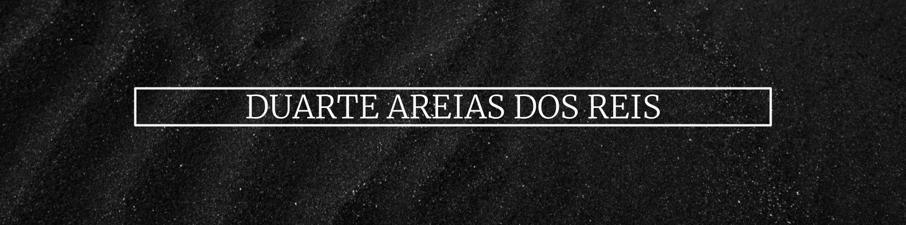

<!--
**Dutesier/Dutesier** is a ✨ _special_ ✨ repository because its `README.md` (this file) appears on your GitHub profile.

Here are some ideas to get you started:

- 🔭 I’m currently working on ...
- 🌱 I’m currently learning ...
- 👯 I’m looking to collaborate on ...
- 🤔 I’m looking for help with ...
- 💬 Ask me about ...
- 📫 How to reach me: ...
- 😄 Pronouns: ...
- ⚡ Fun fact: ...
-->

<h1 align="center"> Hi there fellow coder, 42er or recruiter (one can hope)! </h1>

 (Open for Hiring)

<h2 align="center"> 👨‍💻 About me</h2>

  <samp>
My name is Duarte Areias dos Reis, a.k.a. Dutesier, and I've been learning software development @ 42 Lisboa. I've also been interning here, helping the team develop internal tools, mainly using GO. I have a background in management but coding is my passion. I also love Brazilian Jiu-Jitsu, woodworking and D&D :dragon: 
  </samp>

<h2 align="center"> :wrench: The Road So Far</h2>

  &nbsp;&nbsp;&nbsp;
  &nbsp;&nbsp;&nbsp;
  &nbsp;&nbsp;

C, C++, Go (Golang), Python, Docker, Git, Github, Unity, Blender.

<!--
<h2  align="center">📫 Reach me on</h2>

  &nbsp;&nbsp;&nbsp;&nbsp;
  &nbsp;&nbsp;&nbsp;&nbsp;
  &nbsp;&nbsp;&nbsp;&nbsp;

-->
<h2  align="center">💻 Check Out My Repos ⬇️ </h2>

